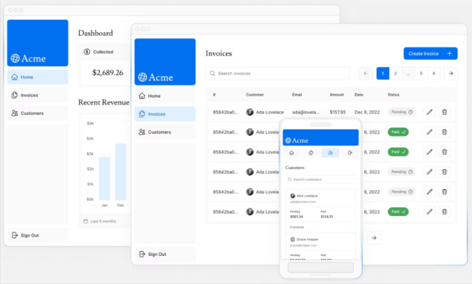

## Next.js Financial Dashboard - Tutorial from the course [Learn Next.js](https://nextjs.org/learn)

During the course, I built a simplified version of a financial dashboard that has:

- A public home page.
- A login page.
- Dashboard pages that are protected by authentication.
- The ability for users to add, edit, and delete invoices.

The dashboard also has an accompanying Postgres database.

### Author

Chiara Stefanelli - Web Developer based in Italy

- Website - [Chiara Stefanelli](https://chiarastefanelli.netlify.app/)
- LinkedIn - [Chiara Stefanelli](https://www.linkedin.com/in/chiarastefanelli/?locale=en_US)
- Frontend Mentor - [Chiara Stefanelli](https://www.frontendmentor.io/profile/chiarastef)
